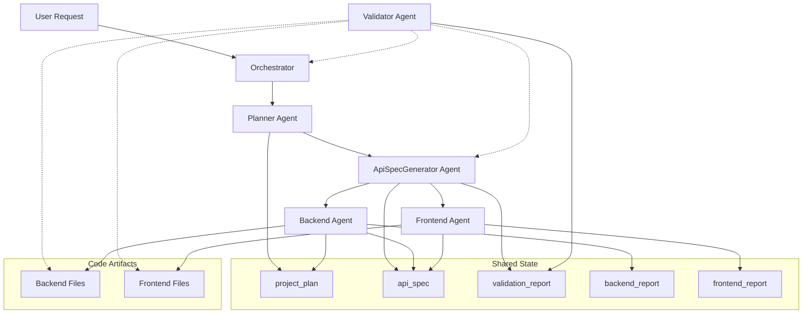

# Design Document

## Overview

The contract-first multi-agent system is designed as a lean, orchestrated workflow where agents maintain strict separation of concerns and communicate through a shared state mechanism. The system follows a linear flow: Planner → ApiSpecGenerator → Backend → Frontend, with an Orchestrator managing state transitions and agent handoffs. All agents output valid JSON only, ensuring machine-readable contracts and eliminating ambiguity.

The design leverages the existing agno framework's Team coordination capabilities while introducing new specialized agents that focus exclusively on contract generation and adherence. The system enforces a fixed technology stack (React+TS+Tailwind, FastAPI, MongoDB) and authentication policy (jwt_with_refresh) to eliminate configuration drift and ensure consistent output.

## Architecture

### System Components



### Agent Hierarchy

1. **Orchestrator** (Team Leader)
   - Manages workflow state transitions
   - Coordinates agent handoffs
   - Handles error recovery and iteration loops
   - Maintains shared state integrity

2. **Planner Agent** (Business Requirements)
   - Transforms user requests into structured business plans
   - Outputs `project_plan` JSON to shared state
   - Never generates API specifications

3. **ApiSpecGenerator Agent** (Contract Specification)
   - Consumes `project_plan` from shared state
   - Generates OpenAPI 3.1 specifications
   - Outputs `api_spec` JSON with validation results
   - Never invents business requirements

4. **Backend Agent** (Implementation)
   - Consumes `api_spec` from shared state
   - Generates FastAPI code conforming to specification
   - Never modifies contracts

5. **Frontend Agent** (Implementation)
   - Consumes `api_spec` from shared state
   - Generates React+TS+Tailwind code conforming to specification
   - Outputs `frontend_report` with implemented components list
   - Never modifies contracts

6. **Validator Agent** (Future Iteration)
   - Validates contract compliance against `api_spec`
   - Reads `backend_report` and `frontend_report` for drift detection
   - Analyzes generated code artifacts for contract adherence
   - Updates `validation_report` in shared state
   - Triggers regeneration when hard drift detected

### Shared State Schema

```json
{
  "project_plan": {
    "project_name": "string",
    "project_description": "string", 
    "business_goals": ["string"],
    "features": [
      {
        "name": "string",
        "description": "string",
        "priority": "high|medium|low",
        "complexity": "simple|moderate|complex",
        "dependencies": ["string"]
      }
    ],
    "entities": [
      {
        "name": "string",
        "description": "string",
        "fields": [
          {
            "name": "string",
            "type": "string", 
            "required": true,
            "constraints": "string"
          }
        ],
        "relationships": ["string"],
        "business_rules": ["string"]
      }
    ],
    "api_surface": ["string"],
    "auth_policy": "jwt_with_refresh",
    "tech_stack": {
      "frontend": "React+TS+Tailwind",
      "backend": "FastAPI", 
      "database": "MongoDB"
    },
    "nonfunctional_requirements": ["string"],
    "environment_vars": ["string"],
    "deliverables_milestones": [
      {
        "milestone": "string",
        "deliverables": ["string"],
        "acceptance_criteria": ["string"]
      }
    ],
    "notes_for_spec": ["string"]
  },
  "api_spec": {
    "api_version": "v1",
    "spec_version": "3.1.0",
    "revision": "1.0.0",
    "generated_by": "ApiSpecGeneratorAgent",
    "openapi_spec": {
      "openapi": "3.1.0",
      "info": {
        "title": "string",
        "version": "string",
        "description": "string"
      },
      "servers": [{"url": "string"}],
      "paths": {},
      "components": {
        "schemas": {},
        "securitySchemes": {
          "bearerAuth": {
            "type": "http",
            "scheme": "bearer", 
            "bearerFormat": "JWT"
          }
        }
      }
    },
    "response_status_map": {
      "201": "Created successfully",
      "400": "Validation error",
      "401": "Unauthorized", 
      "404": "Not found"
    },
    "validation_report": {
      "status": "pass|fail",
      "issues": [
        {
          "rule": "string",
          "level": "error|warning",
          "message": "string",
          "location": "string"
        }
      ]
    }
  },
  "backend_report": {
    "implemented_endpoints": [
      {
        "path": "/api/users",
        "method": "GET",
        "status": "implemented",
        "compliance": "pass"
      }
    ],
    "generated_files": ["app.py", "models.py", "routes.py"],
    "compliance_status": "generated"
  },
  "frontend_report": {
    "implemented_components": ["UserList", "UserForm", "Dashboard"],
    "api_integrations": [
      {
        "endpoint": "/api/users",
        "method": "GET", 
        "component": "UserList",
        "status": "implemented"
      }
    ],
    "generated_files": ["App.tsx", "components/UserList.tsx"],
    "compliance_status": "generated"
  }
}
```

## Components and Interfaces

### Orchestrator Interface

The Orchestrator extends the existing agno Team class with contract-first workflow management:

```python
class ContractFirstOrchestrator(Team):
    def __init__(self):
        super().__init__(
            name="Contract-First Development Team",
            members=[planner_agent, api_spec_generator, backend_agent, frontend_agent],
            mode="coordinate",
            team_session_state={
                "project_plan": {},
                "api_spec": {},
                "current_phase": "planning",
                "workflow_status": "initialized"
            }
        )
    
    def execute_workflow(self, user_request: str) -> dict:
        """Execute the contract-first workflow"""
        pass
    
    def handle_validation_failure(self, validation_report: dict) -> dict:
        """Handle contract validation failures and trigger regeneration"""
        pass
```

### Agent Base Interface

All agents implement a common interface for shared state interaction:

```python
class ContractAgent(Agent):
    def __init__(self, name: str, role: str, input_keys: list, output_keys: list):
        self.input_keys = input_keys
        self.output_keys = output_keys
        super().__init__(name=name, role=role)
    
    def read_shared_state(self, key: str) -> dict:
        """Read from designated shared state keys"""
        pass
    
    def write_shared_state(self, key: str, data: dict) -> bool:
        """Write to designated shared state keys"""
        pass
    
    def validate_json_output(self, output: str) -> bool:
        """Ensure output is valid JSON with no markdown"""
        pass
```

### Planner Agent Implementation

```python
class PlannerAgent(ContractAgent):
    def __init__(self):
        super().__init__(
            name="Planner Agent",
            role="Senior Software Architect",
            input_keys=[],  # Takes user request directly
            output_keys=["project_plan"]
        )
    
    def generate_project_plan(self, user_request: str) -> dict:
        """Transform user request into structured project plan"""
        pass
```

### ApiSpecGenerator Agent Implementation

```python
class ApiSpecGeneratorAgent(ContractAgent):
    def __init__(self):
        super().__init__(
            name="ApiSpecGenerator Agent", 
            role="API Contract Specialist",
            input_keys=["project_plan"],
            output_keys=["api_spec"]
        )
    
    def generate_openapi_spec(self, project_plan: dict) -> dict:
        """Generate OpenAPI 3.1 specification from project plan"""
        pass
    
    def validate_specification(self, spec: dict) -> dict:
        """Run validation on generated specification"""
        pass
```

### Backend Agent Implementation

```python
class BackendAgent(ContractAgent):
    def __init__(self):
        super().__init__(
            name="Backend Agent",
            role="FastAPI Developer", 
            input_keys=["api_spec"],
            output_keys=["backend_report"]  # Reports implemented endpoints
        )
    
    def generate_fastapi_code(self, api_spec: dict) -> dict:
        """Generate FastAPI code conforming to specification"""
        # Generate code artifacts using existing artifact parser
        artifacts = self._create_code_artifacts(api_spec)
        files = save_artifacts_to_files(artifacts, "generated/backend")
        
        # Return structured report for validation
        return {
            "implemented_endpoints": self._extract_endpoints(artifacts),
            "generated_files": files,
            "compliance_status": "generated"
        }
    
    def _create_code_artifacts(self, api_spec: dict) -> List[CodeArtifact]:
        """Create code artifacts with proper tagging"""
        pass
```

### Frontend Agent Implementation

```python
class FrontendAgent(ContractAgent):
    def __init__(self):
        super().__init__(
            name="Frontend Agent",
            role="React Developer",
            input_keys=["api_spec"], 
            output_keys=["frontend_report"]  # Reports implemented components
        )
    
    def generate_react_code(self, api_spec: dict) -> dict:
        """Generate React+TS+Tailwind code conforming to specification"""
        # Generate code artifacts using existing frontend artifact parser
        artifacts = self._create_frontend_artifacts(api_spec)
        files = save_frontend_artifacts_to_files(artifacts, "generated/frontend")
        
        # Return structured report for validation
        return {
            "implemented_components": self._extract_components(artifacts),
            "api_integrations": self._extract_api_calls(artifacts),
            "generated_files": files,
            "compliance_status": "generated"
        }
    
    def _create_frontend_artifacts(self, api_spec: dict) -> List[FrontendCodeArtifact]:
        """Create frontend code artifacts with proper tagging"""
        pass
```

## Code Artifact Integration

The system leverages existing artifact parsing utilities to handle code generation and file management:

### Backend Code Artifacts

```python
from utils.artifact_parser import CodeArtifact, extract_code_artifacts, save_artifacts_to_files

class BackendCodeGenerator:
    def generate_artifacts(self, api_spec: dict) -> List[CodeArtifact]:
        """Generate backend code artifacts from API specification"""
        artifacts = []
        
        # Generate main FastAPI application
        app_artifact = CodeArtifact(
            type="python",
            filename="app.py",
            purpose="Main FastAPI application",
            complexity="moderate",
            content=self._generate_fastapi_app(api_spec)
        )
        artifacts.append(app_artifact)
        
        # Generate models based on API schemas
        for schema_name, schema_def in api_spec["openapi_spec"]["components"]["schemas"].items():
            model_artifact = CodeArtifact(
                type="python",
                filename=f"models/{schema_name.lower()}.py",
                purpose=f"Pydantic model for {schema_name}",
                complexity="simple",
                content=self._generate_pydantic_model(schema_name, schema_def)
            )
            artifacts.append(model_artifact)
        
        return artifacts
```

### Frontend Code Artifacts

```python
from utils.frontend_artifact_parser import FrontendCodeArtifact, extract_frontend_code_artifacts, save_frontend_artifacts_to_files

class FrontendCodeGenerator:
    def generate_artifacts(self, api_spec: dict) -> List[FrontendCodeArtifact]:
        """Generate frontend code artifacts from API specification"""
        artifacts = []
        
        # Generate main App component
        app_artifact = FrontendCodeArtifact(
            type="react",
            filename="App.tsx",
            purpose="Main React application component",
            framework="react",
            complexity="moderate",
            content=self._generate_app_component(api_spec)
        )
        artifacts.append(app_artifact)
        
        # Generate API service layer
        api_artifact = FrontendCodeArtifact(
            type="typescript",
            filename="services/api.ts",
            purpose="API service layer for backend integration",
            framework="react",
            complexity="moderate",
            content=self._generate_api_service(api_spec)
        )
        artifacts.append(api_artifact)
        
        return artifacts
```

### Artifact Validation and Tracking

```python
class ArtifactTracker:
    def track_generated_artifacts(self, artifacts: List[CodeArtifact], agent_type: str) -> dict:
        """Track generated artifacts for validation purposes"""
        return {
            "agent": agent_type,
            "artifact_count": len(artifacts),
            "files": [a.filename for a in artifacts],
            "complexity_distribution": self._analyze_complexity(artifacts),
            "generated_timestamp": datetime.now().isoformat()
        }
    
    def validate_artifact_compliance(self, artifacts: List[CodeArtifact], api_spec: dict) -> dict:
        """Validate that generated artifacts comply with API specification"""
        compliance_report = {
            "status": "pass",
            "issues": [],
            "validated_endpoints": [],
            "validated_schemas": []
        }
        
        # Validate backend artifacts against API spec
        for artifact in artifacts:
            if artifact.type == "python" and "routes" in artifact.filename:
                endpoints = self._extract_endpoints_from_code(artifact.content)
                spec_endpoints = self._extract_spec_endpoints(api_spec)
                
                for endpoint in endpoints:
                    if endpoint not in spec_endpoints:
                        compliance_report["issues"].append({
                            "type": "endpoint_drift",
                            "message": f"Endpoint {endpoint} not in specification",
                            "file": artifact.filename
                        })
        
        return compliance_report
```

## Data Models

### Project Plan Model

```python
from pydantic import BaseModel
from typing import List, Dict, Literal

class Feature(BaseModel):
    name: str
    description: str
    priority: Literal["high", "medium", "low"]
    complexity: Literal["simple", "moderate", "complex"]
    dependencies: List[str]

class EntityField(BaseModel):
    name: str
    type: str
    required: bool
    constraints: str

class Entity(BaseModel):
    name: str
    description: str
    fields: List[EntityField]
    relationships: List[str]
    business_rules: List[str]

class TechStack(BaseModel):
    frontend: Literal["React+TS+Tailwind"] = "React+TS+Tailwind"
    backend: Literal["FastAPI"] = "FastAPI"
    database: Literal["MongoDB"] = "MongoDB"

class Milestone(BaseModel):
    milestone: str
    deliverables: List[str]
    acceptance_criteria: List[str]

class ProjectPlan(BaseModel):
    project_name: str
    project_description: str
    business_goals: List[str]
    features: List[Feature]
    entities: List[Entity]
    api_surface: List[str]
    auth_policy: Literal["jwt_with_refresh"] = "jwt_with_refresh"
    tech_stack: TechStack
    nonfunctional_requirements: List[str]
    environment_vars: List[str]
    deliverables_milestones: List[Milestone]
    notes_for_spec: List[str]
```

### API Specification Model

```python
class ValidationIssue(BaseModel):
    rule: str
    level: Literal["error", "warning"]
    message: str
    location: str

class ValidationReport(BaseModel):
    status: Literal["pass", "fail"]
    issues: List[ValidationIssue]

class ApiSpec(BaseModel):
    api_version: str = "v1"
    spec_version: str = "3.1.0"
    revision: str
    generated_by: str = "ApiSpecGeneratorAgent"
    openapi_spec: Dict  # Full OpenAPI 3.1 specification
    response_status_map: Dict[str, str]
    validation_report: ValidationReport
```

## Error Handling

### Validation Error Recovery

```python
class ValidationErrorHandler:
    def handle_spec_validation_failure(self, issues: List[ValidationIssue]) -> dict:
        """Handle API specification validation failures"""
        for issue in issues:
            if issue.level == "error":
                # Trigger ApiSpecGenerator regeneration with revision increment
                return {
                    "action": "regenerate_spec", 
                    "reason": issue.message,
                    "increment_revision": True
                }
        return {"action": "continue", "warnings": [i.message for i in issues]}
    
    def handle_contract_drift(self, agent_type: str, drift_details: dict) -> dict:
        """Handle contract drift from Backend/Frontend agents"""
        # Differentiate hard vs soft drift
        has_hard_drift = any(
            issue.get("severity") == "critical" 
            for issue in drift_details.get("issues", [])
        )
        
        return {
            "action": "update_validation_report",
            "agent": agent_type,
            "issues": drift_details,
            "trigger_regeneration": has_hard_drift,
            "log_warnings": not has_hard_drift
        }
    
    def increment_revision(self, current_revision: str, change_type: str) -> str:
        """Increment API specification revision based on change type"""
        # Parse semantic version (e.g., "1.2.3")
        parts = current_revision.split(".")
        major, minor, patch = int(parts[0]), int(parts[1]), int(parts[2])
        
        if change_type == "planner_regen":
            major += 1  # Breaking change
            minor, patch = 0, 0
        elif change_type == "spec_regen":
            minor += 1  # Feature change
            patch = 0
        else:
            patch += 1  # Bug fix
            
        return f"{major}.{minor}.{patch}"
```

### Agent Communication Errors

```python
class CommunicationErrorHandler:
    def handle_invalid_json(self, agent_name: str, output: str) -> dict:
        """Handle non-JSON output from agents"""
        return {
            "error": "invalid_output_format",
            "agent": agent_name,
            "expected": "valid JSON",
            "received": output[:100],
            "action": "retry_with_json_constraint"
        }
    
    def handle_missing_shared_state(self, key: str, agent_name: str) -> dict:
        """Handle missing shared state dependencies"""
        return {
            "error": "missing_dependency",
            "key": key,
            "agent": agent_name,
            "action": "execute_prerequisite_agent"
        }
```

## Testing Strategy

### Unit Testing

1. **Agent JSON Output Validation**
   ```python
   def test_planner_json_output():
       planner = PlannerAgent()
       result = planner.generate_project_plan("Build a todo app")
       assert isinstance(result, dict)
       assert "project_name" in result
       assert result["auth_policy"] == "jwt_with_refresh"
   ```

2. **Shared State Integrity**
   ```python
   def test_shared_state_isolation():
       orchestrator = ContractFirstOrchestrator()
       # Test that agents only access designated keys
       assert planner_agent.input_keys == []
       assert planner_agent.output_keys == ["project_plan"]
   ```

3. **Contract Compliance**
   ```python
   def test_backend_contract_compliance():
       api_spec = load_test_spec()
       backend_agent = BackendAgent()
       code = backend_agent.generate_fastapi_code(api_spec)
       # Validate generated code matches specification
       assert validate_fastapi_routes(code, api_spec)
   ```

### Integration Testing

1. **End-to-End Workflow**
   ```python
   def test_complete_workflow():
       orchestrator = ContractFirstOrchestrator()
       result = orchestrator.execute_workflow("Create a blog platform")
       
       assert "project_plan" in orchestrator.team_session_state
       assert "api_spec" in orchestrator.team_session_state
       assert result["backend_files_generated"] > 0
       assert result["frontend_files_generated"] > 0
   ```

2. **Validation Loop Testing**
   ```python
   def test_validation_failure_recovery():
       orchestrator = ContractFirstOrchestrator()
       # Inject validation failure
       orchestrator.inject_validation_failure("schema_mismatch")
       result = orchestrator.handle_validation_failure()
       assert result["action"] == "regenerate_spec"
   ```

### Contract Testing

1. **OpenAPI Specification Validation**
   ```python
   def test_openapi_spec_validity():
       spec_generator = ApiSpecGeneratorAgent()
       project_plan = load_test_plan()
       api_spec = spec_generator.generate_openapi_spec(project_plan)
       
       # Validate with swagger-parser
       assert validate_openapi_spec(api_spec["openapi_spec"])
   ```

2. **Backend-Frontend Contract Alignment**
   ```python
   def test_backend_frontend_alignment():
       api_spec = load_test_spec()
       backend_code = BackendAgent().generate_fastapi_code(api_spec)
       frontend_code = FrontendAgent().generate_react_code(api_spec)
       
       # Validate API calls match endpoints
       assert validate_api_alignment(backend_code, frontend_code, api_spec)
   ```

### Orchestrator State Machine Testing

1. **Workflow State Transitions**
   ```python
   def test_orchestrator_state_transitions():
       orchestrator = ContractFirstOrchestrator()
       
       # Test initial state
       assert orchestrator.team_session_state["current_phase"] == "planning"
       
       # Execute planner
       orchestrator.execute_planner("Build todo app")
       assert orchestrator.team_session_state["current_phase"] == "spec_generation"
       
       # Execute spec generator
       orchestrator.execute_spec_generator()
       assert orchestrator.team_session_state["current_phase"] == "backend_generation"
       
       # Execute backend
       orchestrator.execute_backend()
       assert orchestrator.team_session_state["current_phase"] == "frontend_generation"
       
       # Execute frontend
       orchestrator.execute_frontend()
       assert orchestrator.team_session_state["current_phase"] == "completed"
   ```

2. **Revision Management**
   ```python
   def test_revision_increment():
       handler = ValidationErrorHandler()
       
       # Test patch increment
       assert handler.increment_revision("1.0.0", "bug_fix") == "1.0.1"
       
       # Test minor increment
       assert handler.increment_revision("1.0.5", "spec_regen") == "1.1.0"
       
       # Test major increment
       assert handler.increment_revision("1.2.3", "planner_regen") == "2.0.0"
   ```

### Code Artifact Integration Testing

1. **Artifact Parser Integration**
   ```python
   def test_backend_artifact_generation():
       backend_agent = BackendAgent()
       api_spec = load_test_spec()
       
       # Generate code with artifacts
       result = backend_agent.generate_fastapi_code(api_spec)
       
       # Verify artifacts were created
       assert len(result["generated_files"]) > 0
       assert "app.py" in result["generated_files"]
       
       # Verify report structure
       assert "implemented_endpoints" in result
       assert result["compliance_status"] == "generated"
   ```

2. **Frontend Artifact Generation**
   ```python
   def test_frontend_artifact_generation():
       frontend_agent = FrontendAgent()
       api_spec = load_test_spec()
       
       # Generate code with artifacts
       result = frontend_agent.generate_react_code(api_spec)
       
       # Verify artifacts were created
       assert len(result["generated_files"]) > 0
       assert any("App.tsx" in f for f in result["generated_files"])
       
       # Verify component tracking
       assert "implemented_components" in result
       assert "api_integrations" in result
   ```

### Performance Testing

1. **Agent Response Time**
   ```python
   def test_agent_performance():
       start_time = time.time()
       result = planner_agent.generate_project_plan("Simple todo app")
       duration = time.time() - start_time
       assert duration < 30  # 30 second timeout
   ```

2. **Memory Usage**
   ```python
   def test_memory_efficiency():
       orchestrator = ContractFirstOrchestrator()
       initial_memory = get_memory_usage()
       orchestrator.execute_workflow("Complex e-commerce platform")
       final_memory = get_memory_usage()
       assert (final_memory - initial_memory) < 500  # 500MB limit
   ```